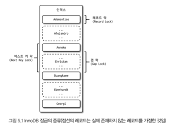
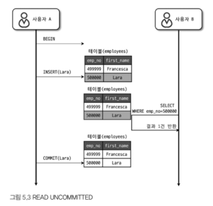
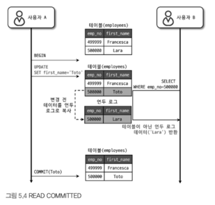
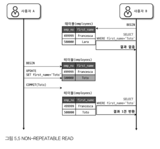
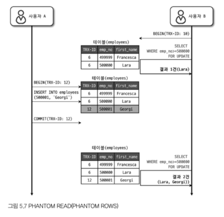

# 5장 트랜잭션과 잠금
- 트랜잭션은 작업의 완전성을 보장해주는 것이다. 즉, 모든 작업에 대해서 원자성을 보장한다.
> 💡 원자성(Atomicity) : All or Nothing을 의미한다.
- 잠금과 트랜잭션은 비슷해 보이나 다르다.
  - 트랜잭션 : `정합성`을 보장
  - 잠금 : `동시성`을 제어
- 여기서 격리 수준(Isolation Level)이란 **트랜잭션 간의 작업 내용을 어떻게 공유하고 차단할 것인지를 결정하는 수준**을 의미한다.

## 5.1 트랜잭션

### 5.1.1 MySQL에서 트랜잭션
- 트랜잭션의 의미는 `원자성`으로부터 존재한다. 즉, 단순히 여러 변경 작업을 수행할 때만 나타나는 것이 아니다.
- 5버전 이전에 사용했던 `MyISAM`과 `MEMORY`에서는 이 정합성을 보장해주지 못해 부분 업데이트가 발생했다. 이는 처리가 상당히 어렵다. 

### 5.1.2 주의사항
- 트랜잭션도 커넥션과 동일하게 최소한의 코드에서만 적용하는 것이 좋다. *(Like Try-Catch)*
- 트랜잭션의 단위가 너무 크다면 커넥션을 너무 오래 가지고 있을 수 있다.
- 또한, 외부에 의존하는 상황이라면 문제의 전파 범위는 생각보다 넓어질 수 있다.
> ex. 외부 API를 호출하는데 해당 API와의 connection issue

## 5.2 MySQL 엔진의 잠금
- 잠금은 크게 스토리지 엔진 레벨과 MySQL 엔진 레벨로 나눌 수 있다.
- MySQL 엔진은 스토리지 엔진을 제외한 모든 영역으로, 스토리지 엔진까지 영향을 줄 수 있다.

### 5.2.1 글로벌 락
- 가장 큰 범위(MySQL 전체)를 가지는 잠금이다. 명령어 : `FLUSH TABLES WITH READ LOCK`
- 다른 세션에서 `SELECT`를 제외하고 모든 `DDL`과 `DML`은 대기 상태로 잠금이 풀릴 때까지 대기 상태로 남는다.
- `mysqldump`로 일관된 백업을 받아야할 때 글로벌 락을 사용한다.
- 8.0 버전부터 InnoDB가 default로 적용되면서 `백업 락` 같이 조금 더 가벼운 글로벌 락이 등장했다.
- 백업 락은 일반적인 테이블 데이터 변경은 허용하지만 스키마나 인증 관련된 작업은 변경할 수 없다.

### 5.2.2 테이블 락
- 개별 테이블 단위로 설정되는 잠금이다. 명령어 : `LOCK TABLES table_name [ READ | WRITE]` 
- 명시적 또는 묵시적으로 특정 테이블의 락을 획득할 수 있지만, **많은 비용을 요구**하기 때문에 크게 사용되는 경우는 없다.
- 묵시적 락은 `MyISAM`, `MEMORY`에서 **테이블의 데이터를 변경할 때만 발생**한다.
- InnoDB에서도 동일하게 묵시적으로 잠금이 걸리지만 **DML는 무시하고 DDL은 락이 걸린다**.

### 5.2.3 네임드 락
- **함수를 이용해서 임의의 문자열에 잠금**을 설정하는 방법이다.
- 테이블이나 레코드와 같은 **데이터베이스 객체가 잠금의 대상이 아니다**. 단순히 사용자가 지정한 문자열에 대해서만 동작한다.
- 자주 사용되지 않고 주로 **여러 클라이언트가 상호 동기화를 처리해야 할 때 사용**된다.
- 또한, 많은 레코드에 대해서 복잡한 조건으로 변경하는 트랜잭션에서 유용하게 사용할 수 있다.
- 8.0 버전부터는 네임드 락을 중첩해서 걸 수 있고 모두 한번에 해제할 수도 있다.

### 5.2.4 메타데이터 락
- **데이터베이스 객체의 이름이나 구조를 변경할 때 사용**하는 잠금이다.
- 명시적으로 사용할 수 있는게 아니라 `RENAME TABLE table_a To table_b`와 같은 명령에서 묵시적으로 걸린다.

> 💡 Online DDL이란? 
> 
> 스키마를 변경하는 중에도 DML을 실행할 수 있도록하는 기능이다.

> 💡 왜 MySQL이 DDL은 단일 스레드에서 동작할까?

## 5.3 InnoDB 스토리지 엔진 잠금
- MySQL 자체에서 제공하는 잠금과 별개로 `레코드 기반의 잠금` 방식을 지원한다.
- **높은 동시성 처리**를 지원하지만 이원화된 잠금 처리 때문에 **MySQL 명령을 통해서 직접 접근하기 어렵다**.
- `information_schema`와 `Performance Schema`를 통해서 모니터링을 하는 방법이 `lock_monitor`를 사용하는 방법보다 낫다.

### 5.3.1 InnoDB 스토리지 엔진의 잠금
- **레코드 기반의 잠금은 매우 작은 공간으로 관리**한다. 따라서 락의 수준이 변경되는 일이 없다. (락 에스컬레이션)
- 일반 DBMS와 다르게 InnoDB는 레코드 사이의 간격을 잠그는 `갭 락`이 존재한다.

#### 5.3.1.1 레코드 락
- 레코드 자체만 잠그는 레코드 락은 다른 사용 DBMS와 동일하다.
- 중요한 점은 레코드 자체가 아니라 **인덱스의 레코드를 잠근다**.
- 보조 인덱스는 `넥스트 키 락` 혹은 `갭 락`을 이용하지만, `PK`와 `유니크 인덱스`에 대해서는 레코드 자체를 잠근다.

#### 5.3.1.2 갭 락
- 레코드 사이의 간격도 잠구는 것으로 사이에 **새로운 레코드가 생성되는 것을 막는 것**이다.

#### 5.3.1.3 넥스트 키 락
- `레코드 락`과 `갭 락`을 합쳐 놓은 잠금이다.
- 바이너리 로그에 기록된 쿼리가 레플리카 서버에서 실행될 때(동기화될 때) **메인 서버와 동일한 결과를 만들어내도록 보장**하는 것이 목적이다.
> 💡 바이너리 로그 (Binary Log, binlog)
> 
> DB 상에서 발생하는 모든 변경을 기록하는 직렬화하여 기록한 로그.  
> 저장하는 포멧은 다음 3가지가 존재한다.
> 
> statement : 실행된 SQL 자체를 보관한다. 용량이 적고 기록이 빠르지만 환경에 따라 다를 수 있다.
> 
> row : 변경된 레코드 자체를 보관한다. 일관성을 좀 더 보장하지만 용량이 크다.
> 
> mixed : statement와 row의 장점을 취합해서 사용하는 방식이다. 기본적으로 statement를 사용하다가 비결정 SQL일 때는 row로 사용한다.

#### 5.3.1.4 자동 증가 락
- 자동으로 증가하는 값을 위해서 `AUTO_INCREMENT`를 제공하는데, **순서를 보장하기 위해서 제공하는 잠금**이다.
- 순간적으로 발생하기 때문에 명시적으로 잠금을 획득할 수 없다.
- 명시적으로 `AUTO_INCREMENT`의 값을 설정해도 자동으로 락이 걸린다.
- 시스템 변수로 `자동 증가 락`의 동작을 변경할 수 있다. (`innodb_autoinc_lock_mode` 참고)
- 자동 증가된 **값이 절대로 줄어들지 않는 이유는 잠금을 최소화하기 위함**이다.

### 5.3.2 인덱스와 잠금
- 앞서 언급했듯이 **레코드 락은 정확하게 인덱스를 잠그는 것**이다.
> 🤔 다음 쿼리에서는 얼마나 많은 레코드에 잠금이 걸릴까?
> 
> `UPDATE employees SET hire_date=NOW() WHERE first_name='Georgi' AND last_name='Klassen';`
> 
> `first_name`에만 해당하는 레코드가 250건일 때, 여기에만 인덱스가 설정되어 있다면 250건 모두 잠긴다.
> 
> 반대로 어떤 인덱스도 존재하지 않는다면 해당하는 **모든 레코드에 잠금이 걸린 뒤 풀 스캔을 진행**한다.

## 5.4 MySQL의 격리 수준
- 격리 수준이란, **트랜잭션 간의 작업 내용을 어떻게 공유하고 차단할 것인지를 결정하는 수준**을 의미한다.
- 다음 그림과 같이 격리 수준이 존재하고, 각 격리 수준마다 이상 현상이 존재한다.

- InnoDB가 기본인 최근 MySQL에서는 `Repeatable Read` 수준에서도 `Phantom Read`가 발생하지 않는다.
- 일관성과 동시성은 반비례 관계이므로 `Level 0`과 `Level 3`은 잘 사용되지 않는다.

### 5.4.1 READ UNCOMMITTED
- 각 트랜잭션에서의 변경 내용이 `COMMIT`, `ROLLBACK` 여부 상관 없이 다른 트랜잭션에 보이는 수준이다.

- 변경 작업 중에 **다른 트랜잭션에서 조회 시에 반영되지 않은 데이터를 가져오는 현상**을 `Dirty Read`라고 부른다.

### 5.4.2 READ COMMITED
- 오라클의 기본 격리 수준이면서 가장 많이 사용되는 격리 수준이다.

- 반영된 데이터만 읽기 때문에 `Dirty Read` 현상은 나타나지 않는다. `Undo Log`에서 기존 데이터를 불러온다.
- 이 격리 수준에서는 `NON-REPEATAABLE READ` 현상이 발생한다.
> 💡REPEATAABLE READ?
> 
> 하나의 트랜잭션에서 `SELECT`는 항상 같은 결과를 반환해야 한다.

- 그림으로 나타내면 다음과 같다.

### 5.4.3 REPEATABLE READ
- MySQL의 기본 수준이다. InnoDB는 Roll back의 가능성을 염두해서 **이전 레코드를 백업해두고 실제 레코드를 변경**한다.
- `READ COMMITED`도 동일하게 동작하는데 `REPEATABLE READ`과의 차이는 **MVCC의 버전 차이**이다.
- 모든 트랜잭션은 고유한 번호(`GTID`)를 가진다. 이 ID는 백업 데이터에 포함돼 있다.
- `REPEATABLE READ`에서는 실행 중인 가장 오래된 트랜잭션의 ID보다 앞선 모든 백업 데이터를 보관해서 정합성을 유지한다. (물론 모두 보관하는 것은 또 아니다.)

- 백업 데이터는 모두 `Undo Log`에 저장되기 때문에 트랜잭션이 너무 길어진다면 너무 많은 데이터로 인해서 성능이 떨어질 수도 있다.
- `REPEATABLE READ` 격리 수준에서도 `PHANTOM READ`라고 불리우는 이상 현상이 존재한다. (물론 InnoDB에서는 발생하지 않는다.) 

- `PHANTOM READ`는 여러 데이터를 조회할 때, **특정 레코드가 보였다 안 보였다 하는 현상**을 의미한다.
- `Undo Log`와 같은 **백업 공간에도 잠금을 걸 수 없기 때문에 실제 레코드를 읽어오면서 이런 현상이 발생**한다. 

> 💡왜 InnoDB에서는 Phantom Read가 발생하지 않을까?
> 
> `Next-Key Lock`을 제공하기 때문이다. 레코드뿐 만 아니라 그 사이에도 잠금을 걸어서 일관성을 유지한다.

### 5.4.4 SERIALIZABLE
- 가장 단순하면서 가장 엄격한 격리 수준이다.
- 앞서 언급한 것처럼 **동시성과 일관성은 반비례 관계**이므로 잘 사용하지 않는다.

