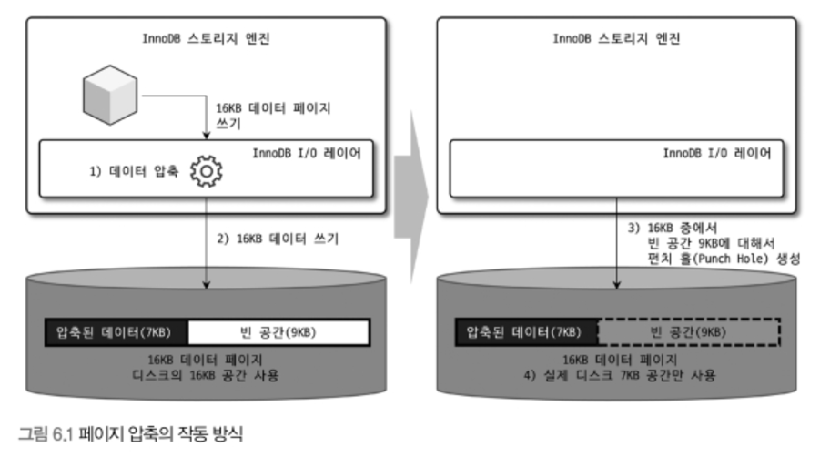

# 6장 데이터 압축
- 디스크에 저장된 데이터의 크기 자체는 쿼리 성능과 직결되지 않지만, 백업과 복구 작업과는 밀접한 관계를 가진다.
- 더 많은 페이지를 버퍼 풀로 읽어야 하고, 많아진 페이지는 곧 많은 더티 페이지를 만들기 때문이다.
- 데이터 파일이 크면 클 수록 비용이 더 발생하니 MySQL에서는 데이터 압축 기능을 제공한다.

## 6.1 페이지 압축
- 페이지 압축은 `Transparent PAge Compression`이라고도 불린다.
- 디스크에 **저장할 때 페이지가 압축해서 저장하고 읽어올 때 압축을 해제**한다. 즉, `버퍼 풀에서는 압축이 해제된 페이지를 관리`한다.
- 16KB의 페이지를 **압축한 용량이 얼마나 될지 예측이 어렵다**. 적어도 하나의 테이블은 동일한 크기로 통일돼야 한다.
- 이 문제를 해결하기 위해서 **OS에서 제공하는 펀치 홀**이라는 기능을 활용한다.
- 하지만 OS에 대한 의존성이 생겨 잘 사용하지 않는 방법이다.

## 6.2 테이블 압축
- 하드웨어에 대한 의존성이 없기 때문에 활용도가 더 높다. 물론 다음과 같은 단점이 존재하기 때문에 잘 이해하고 사용해야 한다.
  - 낮은 버퍼 풀 공간 활용도
  - 낮은 쿼리 성능
  - 빈번한 데이터 변경 시 떨어지는 압축률
- 테이블 압축의 전제 조건은 `별도의 테이블 스페이스를 사용한다`는 것이다.
- 이후 부분은 필요할 때 책을 참고하자.

