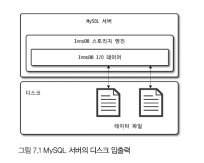
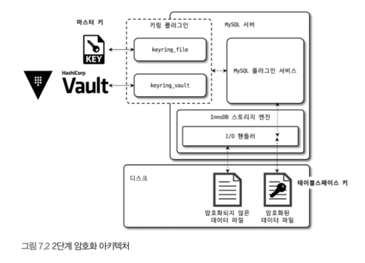

# 7장 데이터 암호화
- 5.7 버전까지는 데이터 파일에 대해서만 암호화가 가능했다.
- 8.0 버전부터는 데이터 파일 외에도 `Redo-Log`, `Undo-Log`, `B-Log` 암호화를 지원한다.

## 7.1 MySQL
- 암호화(복호화) 기능은 디스크와 핸들러 사이에서 동작한다. 즉, `I/O 레이어 외에는 의미가 없다`는 뜻이다.



- 다시 말해서 **서버 자체에서 쿼리를 처리할 때 암호화 여부는 의미가 없다**는 뜻이다.
- 사용자와 서버 내부 입장에서 아무런 차이가 없는 암호화 방식을 `TDE(Transparent Data Encryption)` 혹은 `Data at Rest Encryption`라고 한다.

### 7.1.1 2단계 키 관리
- MySQL의 TDE 암호화 키는 키링 플러그인에 의해 관리된다.
- 다양한 플러그인이 존재하지만 마스터 키를 관리하는 방법만 다르고 **내부 동작 방식은 동일**하다.
- 키 관리 아키텍처는 다음과 같다.



- `마스터 키`와 `테이블스페이스 키` 두 가지 종류의 키로 암호화를 한다.
- `테이블스페이스 키`는 프라이빗 키라고 부르는데, 암호화된 **테이블이 생성될 때마다 프라이빗 키를 발급**한다.
- 그리고 **마스터 키를 가지고 프라이빗 키를 암호화한 뒤 테이블 헤더에 저장**한다.
- 새로운 마스터 키로 변경하면 기존 마스터 키로 프라이빗 키를 모두 복호환 뒤 다시 암호화해야 한다. 이 2단계 암호화 방식은 **시스템 부하를 피하기 위함**이다.
- TDE에서 지원하는 알고리즘은 `AES-256`이다.

### 7.1.2 암호화의 성능
- 버퍼 풀에 존재하지 않는 페이지는 당연히 복호화 과정을 거쳐 약간의 지연이 발생한다.
- 그리고 암호화된 테이블이 변경되면 디스크에 쓰기 작업을 할 때 암호화 과정을 거쳐 시간이 추가로 걸린다. 하지만 이는 백그라운드 스레드가 수행하므로 실제 영향은 없다.
- 즉, 버퍼 풀로 읽어올 때 **새로운 페이지의 경우에만 지연이 발생**한다.
- AES 암호화 알고리즘은 키에 따라 결과의 크기가 달라질 수 있으나 이미 **페이지는 키보다 훨씬 크기 때문에 이런 영향에서 자유롭다**.
- 동시에 압축과 암호화가 발생하면, 압축부터 수행하고 암호화를 적용한다.
  - 암호화 시 랜덤한 바이트 배열을 생성하는데 이는 압축률을 깨트린다.
  - 암호화가 먼저 일어나면 버퍼 풀에 오갈 때 매번 암복호화 작업을 수행해야 되기 때문이다.

### 7.1.3 암호화와 복제
- 레플리카 서버가 소스 서버와 모두 동일하진 않는다. 노드마다 각자의 마스터 키를 가지기 때문이다.

## 7.3 테이블 암호화
- 앞서 언급한 것처럼 **키링 플러그인은 마스터 키를 생성하고 관리**하기만 한다.

### 7.3.1 테이블 생성
- 생성은 다음처럼 추가 명령어를 사용한다.
```sql
CREATE TABLE tab_encrypted (
    id INT,
    data VARCHAR (100), 
    PRIMARY KEY(id)
) ENCRYPTION='Y':
```
- 시스템 변수(`default_table_encrytion`)를 활성화하면 옵션을 따로 설정하지 않아도 괜찮다.

### 7.3.2 응용 프로그램 암호화와의 비교
- 응용 프로그램에서 직접 암호화해서 MySQL로 저장하는 경우도 있는데 `MySQL은 이미 암호화되었는지 모른다`.
- 이런 경우 인덱스를 제대로 활용할 수 없다. 따라서, 최대한 **MySQL에서 제공하는 암호화를 사용할 것을 권장**한다.
- 하지만 목적과 용도에 따라 다르기 때문에 알맞게 선택해야 한다.

### 7.3.3 테이블스페이스 이동
- 테이블을 다른 서버로 복사할 때, 레코드를 덤프하고 복구하는 것보다 테이블스페이스 이동이 훨씬 효율적이고 빠르다.
- 하지난 TDE가 적용되어 있다면 마스터 키가 다르므로 더 고려해야할 부분이 존재한다.

## 7.4 언두 로그 및 리두 로그 암호화
- 8.0.16 이전에는 테이블 암호화를 적용하더라도 각 로그는 평문으로 저장하다가 개선되었다.
- 테이블과 다르게 언두 로그와 리두 로그는 암호화를 활성화한다고 해당 시점을 기준으로 바로 모두 암호화를 적용할 수는 없다.
- 반대로, 암호화를 해제한다고 바로 키가 필요없는 것이 아니다. 어떤 로그는 암호화 상태로 남아있을 수 있기 때문이다.
- 언두 로그와 리두 로그도 테이블과 마찬가지로 테이블스페이스 키로 암호화된다. 그리고 동일하게 로그 헤더에 프라이빗 키가 저장된다.

## 7.5 바이너리 로그 암호화
- 바이너리 로그도 마찬가지로 테이블 암호화가 적용되어도 평문으로 저장된다.
- 근데 언두 로그나 리두 로그에 비해서 보안적으로 더 민감할 수 있다.
- 바이너리 로그나 릴레이 로그는 `디스크에 저장된 로그 파일만 암호화`하고 레플리카와 소스 서버 간의 네트워크 구간에서는 암호화를 하지 않는다.
- 두 서버 간의 보안은 `SSL`로 다룰 수 있다.

### 7.5.1 바이너리 로그 암호화 키 관리
- 앞서 봤던 2단계 암호화 키 관리 방식을 동일하게 사용한다.
- 기존의 방식과 조금 다르게 `프라이빗 키를 파일 키로 암호화해서 디스크에 저장`한다.
- 그리고 각 파일의 헤더에 파일 키를 저장한다.
